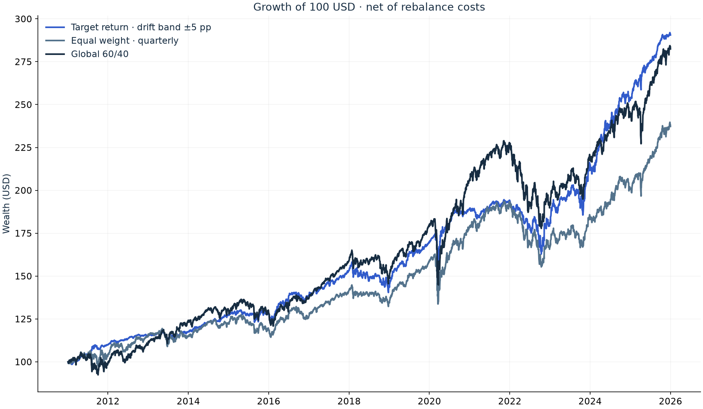

# Global Multi-Asset Portfolio Research

A practical quant-finance study: do optimized portfolios offer a useful improvement over a
simple global 60/40 policy once risk and trading costs are taken into account?

<p align="center">
  <a href="https://portfolio-management-project.streamlit.app/">
    
  </a>
</p>

<p align="center">
  <a href="https://github.com/pablovt3/portfolio_management_project/actions/workflows/quality.yml"></a>
  <a href="LICENSE"></a>
  
</p>

The workflow starts with prices, makes the estimation assumptions explicit, tests allocations
without future data, and explains the resulting trade-offs. The goal is a defensible research
process—not a claim that one model will always win.

## Start with the evidence

| Explore | What you will find |
|---|---|
| **[Live dashboard](https://portfolio-management-project.streamlit.app/)** | Interactive explanation of the universe, benchmark, portfolio construction, out-of-sample results, risk, costs and robustness |
| [Research notebook](notebooks/portfolio_optimization_study.ipynb) | A guided, reproducible analysis of the published evidence |
| [Executive note](reports/executive_summary.md) | The current findings and their practical interpretation |
| [Methodology](docs/methodology.md) | Definitions, assumptions and limitations |

[](https://portfolio-management-project.streamlit.app/)

*Preview of the published out-of-sample wealth paths. Open the dashboard to inspect the full
study, compare strategies and understand the benchmark.*

## The experiment

| Question | Research choice |
|---|---|
| What can we hold? | VTI, VEA, VWO, IEF, TIP, LQD, VNQ, GLD and BIL |
| What are we testing? | Equal weight, minimum variance, mean–variance, target return and maximum Sharpe |
| What is the reference? | 60% VT / 40% BND, rebalanced quarterly |
| How do we estimate? | 756 trailing daily returns; historical mean and Ledoit–Wolf covariance |
| What constrains the portfolio? | Long-only, fully invested, 35% maximum per ETF |
| When do we trade? | Monthly, quarterly, or when a weight breaches a ±2.5, ±5 or ±7.5 percentage-point drift band |
| What does trading cost? | 10 bps on gross rebalance notional for strategies and benchmark |
| What is the baseline period? | 2011–2025; history begins in 2008 for training |
| How do we measure Sharpe? | Annualized daily excess-return mean / standard deviation, using dated BIL returns |

Initial purchases are not charged on either side. CAGR and arithmetic excess-return Sharpe
answer different questions; they should not be substituted for one another. The full-sample
frontier is a model diagnostic, separate from the walk-forward results.

The 7% target is an estimation objective, not a promised return. When it is infeasible, the
model uses the closest feasible value and records that adjustment in `allocation_audit.csv`.

The drift-band portfolios update their target weights monthly but do not automatically trade
on those dates. Before each day's return, current weights are compared with the latest target;
if any absolute gap is larger than the configured band, the portfolio fully rebalances to that
target and pays costs. For example, a 20% target with a ±5 percentage-point band may move
between 15% and 25%. The three bands are declared scenarios rather than optimized parameters.
Their purpose is to show the trade-off between target discipline, turnover and net results.

## Reproduce locally

```bash
conda env create -f environment.yml
conda activate pm_project
python scripts/build_data.py
python scripts/run_study.py
jupyter lab notebooks/portfolio_optimization_study.ipynb
streamlit run dashboard/app.py
```

After the first download, the study uses cached prices. Use `--no-images` to skip optional
PNG export. The notebook reads the published evidence by default; its final section shows
how to rerun the whole study. No financial logic is hidden in notebook cells.

## Code map

```text
configs/                         Research assumptions, universe and benchmark
src/portfolio_management_project/
    config.py                    Validated settings
    research.py                  One entry point for a complete study
    evaluation.py                Study-specific realized Sharpe convention
    pipelines/                   Data, EDA, allocation, backtesting and robustness
    presentation/                Shared evidence reader, labels, charts and dashboard
scripts/                         Small command-line entry points
notebooks/                       Guided analysis over the same published tables
reports/                         Compact evidence, figures and executive note
tests/                           Financial invariants, publication and UI checks
```

Optimization, returns, covariance, risk measures and trading engines come from
[`portfolio-management-module`](https://github.com/pablovt3/portfolio_management_module).
This project chooses the experiment and presents the evidence. It does not reimplement the
library's optimizers. The project adapter uses the library's active-return ratio against BIL
to implement a dated cash-reference Sharpe without altering the library's scalar-rate API.

## Read the ranking carefully

The scorecard averages ranks for CAGR, volatility, Sharpe, maximum drawdown, Calmar,
turnover, information ratio and average largest position. Lower is better. Values are rounded
to ten decimals before ranking to avoid artificial differences at numerical precision.
Several criteria overlap; equal indicator weights do not mean equal economic importance.
The benchmark is shown alongside the strategies but is not included in their ranking.

Window sensitivity starts in 2013 so every window has enough training history. All window
scenarios share that calendar. Cost and position-limit scenarios use the baseline calendar.
Failures remain visible instead of being replaced by zero returns or silently discarded.

## Quality and publication

```bash
make quality
```

Tests check timing, cost symmetry, cash alignment, numerical ties, evidence consistency,
notebook parity and every dashboard section. Changes to methodology require regenerating
all published results; the dashboard rejects a different configuration digest.

Git contains the English source, notebook, README, documentation and compact outputs.
Local Spanish equivalents use `README.es.md`, `*.es.ipynb` and `locales/es.json`; they are
ignored. The language selector appears when a local translation catalog is available.
The English repository does not require these local files or link to missing translations.

The Streamlit deployment is an evidence viewer: it installs only the presentation dependencies
declared in `dashboard/requirements.txt` and reads the checked-in report tables. Rebuilding the
research still requires `portfolio-management-module`; the deployed app does not receive access
to that private development repository.

## Scope and limits

ETF availability is selected with hindsight. The study is in USD and excludes taxes,
market impact, changing spreads, liabilities and currency hedging. BIL is a cash ETF proxy,
not a guaranteed risk-free asset. Ranking strategies after observing the same evaluation
sample is exploratory; use an independent holdout or a prospective paper portfolio before
claiming selection skill. This is research, not a forecast or personal investment advice.

[MIT license](LICENSE) · [Citation](CITATION.cff)
